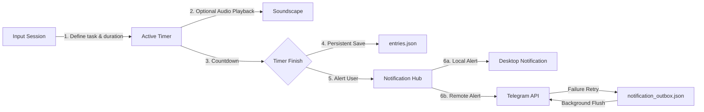

<div align="center">
  <h1>Kairu TUI</h1>
  <p>A keyboard-first, cross-platform productivity hub for the terminal</p>
</div>

<div align="center">
  
  
  
</div>

---

## What is Kairu TUI?

Kairu TUI is a sophisticated terminal-based productivity tool designed for deep focus and consistent habit building. Built with Go and the Bubbletea framework, it combines a Pomodoro-style timer with advanced streak tracking, atmospheric soundscapes, and a robust notification engine. It is built for developers and power users who live in the terminal and value privacy, speed, and keyboard-centric workflows.

## How it works

Kairu operates on a local-first principle, ensuring all your data remains on your machine while providing the convenience of multi-channel notifications via Telegram for mobile alerts.

### Architecture Diagram

```text
[ User Input ] <---> [ Bubbletea TUI ] <---> [ Local Storage (JSON/YAML) ]
                          |
                          v
               [ Soundscape Engine ] ----> [ External Audio Player (mpv) ]
                          |
                          v
               [ Notification Hub ] ----> [ Desktop Notifications ]
                          |
                          +-------------> [ Telegram Bot API ]
                          |                      ^
                          v                      |
               [ Outbox Retry Logic ] <----------+
```

### Project Structure & Modularization

The codebase follows a modular architecture where the root `main.go` acts solely as a coordinator, delegating all operations to separate, self-contained packages under `internal/`:

*   **[main.go](file:///D:/Projects/Personal/kairu-tui/main.go)**: Entrypoint. Responsible for flag parsing, executing offline CLI utilities (e.g. backup, restore, import, export), and bootstrapping the primary TUI loop.
*   **[internal/config](file:///D:/Projects/Personal/kairu-tui/internal/config/)**: Handles application configuration (`Config` struct, default values), platform path resolution (XDG standards), environment loading, and theme/font registrations.
*   **[internal/timer](file:///D:/Projects/Personal/kairu-tui/internal/timer/)**: Handles duration math, converting clock/time formatting, and validating time input strings.
*   **[internal/entries](file:///D:/Projects/Personal/kairu-tui/internal/entries/)**: Data persistence model for focus sessions, file validation, and log importing/merging.
*   **[internal/templates](file:///D:/Projects/Personal/kairu-tui/internal/templates/)**: Custom template structure and storage management.
*   **[internal/backup](file:///D:/Projects/Personal/kairu-tui/internal/backup/)**: Zip-less serialization logic to bundle config, history logs, templates, and outbox lists into backup states.
*   **[internal/streak](file:///D:/Projects/Personal/kairu-tui/internal/streak/)**: Real-time streak statistics engine and recovery period calculations.
*   **[internal/analytics](file:///D:/Projects/Personal/kairu-tui/internal/analytics/)**: Core analytics aggregations and markdown report compiler.
*   **[internal/notification](file:///D:/Projects/Personal/kairu-tui/internal/notification/)**: Multichannel delivery driver supporting sound executors, desktop OS channels, Telegram API webhooks, and local outbox queue management.
*   **[internal/soundscape](file:///D:/Projects/Personal/kairu-tui/internal/soundscape/)**: Audio file parser and built-in synthesizer sound wave generator.
*   **[internal/pet](file:///D:/Projects/Personal/kairu-tui/internal/pet/)**: Cyber-Tamagotchi state engine, food/item inventory database, action controllers, and technical mini-games logic.
*   **[internal/kairutype](file:///D:/Projects/Personal/kairu-tui/internal/kairutype/)**: Speed-typing simulator core, dictionaries, caret tracking, and telemetry recorder.
*   **[internal/tasks](file:///D:/Projects/Personal/kairu-tui/internal/tasks/)**: Suggested tasks lists provider.
*   **[internal/tui](file:///D:/Projects/Personal/kairu-tui/internal/tui/)**: Presentation layer. Orchestrates Bubbletea's MVU (Model-View-Update) routing loop, keyboard key bindings, and subview layouts.

### Hard Rules

- **Local-First:** All session history (`entries.json`) and configuration remain local. No mandatory cloud accounts.
- **Keyboard-Driven & Accessible:** Every action, from starting a timer to managing templates and navigating settings, is accessible via hotkeys and arrow keys.
- **Offline Resilience & Concurrent Alerts:** Active alerts trigger on all enabled channels concurrently (Desktop toast, Sound, and Telegram Bot). Local outbox queue persists unsent notifications on failures, ensuring you never lose a streak.
- **Robust Session Retention:** Countdown timers continue to tick in the background while settings, help, templates, and dashboard screens are open, and your active session is safely written to disk even if you quit the app from any modal view.
- **Customizable Aesthetics:** Support for multiple color themes (Matrix, Cyberpunk, etc.) and layouts (Classic, Compact, Minimal).
- **Zero Distraction:** No GUI overhead. Purely terminal-based focus.

### Pipeline Diagram



## Live Demo

*Coming soon: Terminal recording or ASCIINEMA link.*

## Setup

### Prerequisites

- **Go:** 1.22 or higher
- **mpv:** (Recommended) Required for soundscape playback
- **Telegram Bot:** (Optional) Required for remote notifications

### Install

```bash
git clone https://github.com/sudo-Harshk/kairu-tui.git
cd kairu-tui
go build -o kairu
```

### Configure

1. Create a `kairu.yaml` for basic settings (theme, durations).
2. Create a `.env` file if using Telegram:
   ```env
   KAIRU_TELEGRAM_BOT_TOKEN=your_token_here
   KAIRU_TELEGRAM_CHAT_ID=your_chat_id_here
   ```

### Run

```bash
./kairu
```

## Usage

### Core Hotkeys
- `Tab`: Switch between input fields and views.
- `Space`: Pause or resume the active timer.
- `Ctrl + P`: Open the Template Manager.
- `Ctrl + B`: Toggle the Soundscape selector.
- `Ctrl + T`: Open the interactive Cyber-Tamagotchi handheld console.
- `S`: Open the Settings panel.
  - **Vertical Navigation:** Move cursor using `Up`/`Down` Arrows, `j`/`k`, or `Tab`/`Shift+Tab`.
  - **Toggling & Selection:** Cycle presets or toggle options using `Space` or `Enter`.
  - **Incremental Adjustment:** Change volume levels, frequency offsets, or hours using `Left`/`Right` Arrows or `h`/`l`.
  - **Exit Settings:** Exit back to your previous active view (timer, break, or stats) using `Esc`.
- `Ctrl + Y`: Open the Kairu-Type minimalist speed-typing arena.
- `?`: Toggle the help overlay.

### Soundscapes
Kairu includes a built-in Soundscape selector to help you maintain focus during work sessions. Press `Ctrl+B` from the input screen or while a timer is running to toggle the selector.

* **Natively Synthesized Tracks (No Dependencies):** Kairu features a built-in pure Go synthesizer engine that generates focus frequencies directly. These do not require any external audio players or files:
  * `[Synth] White Noise`
  * `[Synth] Pink Noise` (1/f distribution for gentle focus)
  * `[Synth] Brown Noise` (1/f² distribution for deep isolation)
  * `[Synth] Focus Binaural Beats` (Detuned carrier waves with adjustable presets to induce specific brainwave states)
* **Custom Audio Tracks (External Player):** To play your own files, place `.mp3`, `.wav`, `.ogg`, `.flac`, or `.m4a` files in the `soundscapes_dir` (default: `soundscapes/`). This requires an external player like `mpv` configured in `kairu.yaml`.

*Kairu automatically performs smooth, organic cubic smoothstep volume fading on native soundscapes when you pause/resume the timer, which can be tuned in the Settings menu.*

### Ambient & Synth Tuning
Press **S** to open settings and configure your focus environment:
- **Synth volume:** Adjust the master base level (0% to 100%).
- **Binaural preset:** Select a target neural frequency:
  - **Alpha (10Hz):** Relaxed focus & learning (120Hz carrier)
  - **Beta (20Hz):** Active thinking & coding (150Hz carrier)
  - **Theta (6Hz):** Deep focus & creative flow (100Hz carrier)
  - **Delta (3Hz):** Deep relaxation & rest (70Hz carrier)
  - **Custom:** Manually adjust carrier frequency and beat detuning gap in real time.
- **Fade speeds:** Configure fade-in and fade-out durations in milliseconds for smooth, pop-free audio transitions.


### Streak Recovery
Kairu features a unique **Recovery Mode**. If you miss exactly one day of work, the app enters recovery state. Completing a single session before midnight will "recover" your streak, preventing the demotivation of a reset.

### Cyber-Tamagotchi Interactive Companion (ASCII Console)
To combat developer fatigue and keep your deep-work sessions engaging, Kairu features a highly interactive **Cyber-Tamagotchi Companion**—**Neko the Robo-Kitty**! Neko sits side-by-side with your active forms and countdown timer clocks in wide terminals, or can be fully interacted with via a dedicated handheld console screen:

*   **Dedicated Handheld LCD Screen (`Ctrl + T`)**: Step inside a retro classic handheld game console casing, beautifully constructed in raw Unicode. View status bars for **Health**, **Hunger**, **Happiness**, **Cleanliness**, and **Energy** in real time!
*   **Real-Time 500ms Animations**: Driven by an isolated asynchronous render ticker, Neko breathes, blinks, and animates smoothly in real time at a responsive **500ms interval**—even if the user is sitting completely idle on the main input screen.
*   **Dynamic 15s dialogue & Micro-Actions**: Neko's thoughts update dynamically every **15 seconds** with developer-centric dialogue and micro-actions (like chasing a virtual cursor, wiggling ears, yawning at syntax, or stretching claws) based on its current level and mood.
*   **Active Focus Interventions**: During deep-work Pomodoro blocks, Neko acts as your active focus buddy, dynamically intercepting regular text at key milestones (like 5, 10, 15, 20, 25, 30, 40, and 50 minutes) to bring you virtual tea 🍵, encourage deep focus frequency synchronization 🎧, remind you to stretch your paws 🐾, and congratulate your coding sprints!
*   **Real-Time Offline Decay & Catch-Up**: Stats decay dynamically over time—even when the application is closed! When you launch Kairu, Neko catches up on simulated time, waking up, getting hungry, popping, or potentially getting sick if neglected.
*   **Pomo-Coin Economy & Shop**: Earn **Pomo-Coins** by completing focus sessions (e.g. 1 coin per minute). Spend your hard-earned coins in the shop to buy foods (*Fish Kibble*, *Cyber Cookies*, *Cyber Colas*) or life-saving *Anti-Virus Medicine*!
*   **Terminal Mini-Games**: Play fully-interactive mini-games directly in the LCD screen to raise Neko's happiness and earn extra coins:
    *   **Pomo-Type**: A technical coding speed-typing test that tracks WPM and accuracy!
    *   **Binary Guessing Game**: Guess the decimal equivalent of Neko's secret 4-bit binary byte!
*   **Progressive Leveling & Evolution**: Gaining XP triggers level-ups, evolving Neko across three distinct growth phases: *Baby Droid*, *Robo-Teenager*, and *Cyber-Ascended God*.
*   **Rare Cosmetic Loot & Rebirth**: Work blocks yield a 15% random chance to discover rare cosmetic items (*Wizard Hat*, *Cyber Visor*, *Golden Crown*, etc.) to display on Neko's avatar. If Neko sadly passes away due to extreme neglect, rebirth them with a new name while keeping your inventory and coin balance!
*   **Sidebar Toggle**: Press **`Ctrl + G`** at any time to instantly hide or show your animated buddy in the workspace sidebar.

#### Focus Interventions Milestones
During an active work session, Neko dynamically updates its thoughts during the first 30 seconds of these key milestones:
*   **5 min**: Brings you a warm virtual green tea 🍵
*   **10 min**: Synchronizes your focus frequencies to deep neural flow states 🎧
*   **15 min**: Reminds you to adjust your posture and stretch your paws 🐾
*   **20 min**: Calibrates cyber-visor sensors to match your high coding output ⚡️
*   **25 min**: Cheers you on for hitting the core Pomodoro interval 💻
*   **30 min**: Curls up on your terminal window in proud satisfaction ❤️
*   **40 min**: Celebrates your absolute mastery of complex coding routines 🏆
*   **50 min**: Emits a legendary ascension state to match your focus streak 🚀

### Visual Analytics Dashboard
Kairu features a highly visual, theme-cohesive **Analytics** dashboard. Press `Tab` to cycle through the stats views from your active screen to open the dashboard cards:
- **Productivity Summary:** Displays aggregated stats such as total sessions, work/break ratios, average/longest session lengths, and busiest days.
- **Top Focus Tasks:** A horizontal unicode bar chart showing time allocation across your top 5 tasks, along with exact duration and percentage contribution.
- **Top Tags & Categories:** An advanced category breakdown rendering horizontal visual progress bars based on session tags to track exactly where your time is being invested.
- **Theme-Adaptive & Responsive:** Box borders and progress bars dynamically scale to fit your terminal width and automatically shift colors to match your current active visual theme (Forest, Cyberpunk, Matrix, etc.).

### Kairu-Type Minimalist Typing Arena (`Ctrl + Y`)
Kairu features a fully integrated speed-typing simulator inspired by Monkeytype, designed to help developers warm up their fingers or practice programming muscle memory.
- **Sleek Minimalist Aesthetic:** Frameless paragraph display where untyped words are dim gray, correct keys are bright white/green, and typos are highlighted in red. Includes a reactive color-block caret.
- **Exact Caret Alignment:** Custom space-preserving wrapping ensures butter-smooth, 1-to-1 cursor movements across line breaks.
- **Multiple Test Modes:** Cycle settings while idle using `Tab`:
  - **Time Mode:** 15, 30, or 60-second countdown tests driven by Kairu's second ticker.
  - **Words Mode:** Race to type 10, 25, or 50 generated words.
- **Curated Developer Lexicon:** Custom word generator pulling from a ~200-word bank of programming constructs (`goroutine`, `interface`, `pointer`, `mutex`, `struct`, etc.).
- **Live Performance Analytics:** Completing a test renders a visual ASCII WPM progression line chart showing WPM speed spikes and error drops over time, alongside raw WPM and accuracy metrics.
- **Break Time Synergy:** Complete typing tests during active Pomodoro breaks to earn bonus Pomo-Coins (+1 coin per 10 WPM above 40 WPM, up to 15 coins!) to spend in Neko's shop.
- **Personal Records:** High scores are automatically tracked and saved local-first to `typing_records.json`.


## Tech Stack

| Component | Technology | Role |
| :--- | :--- | :--- |
| Language | Go | Core Logic & CLI |
| TUI Framework | [Bubbletea](https://github.com/charmbracelet/bubbletea) | State Management & UI |
| Styling | [Lipgloss](https://github.com/charmbracelet/lipgloss) | Terminal UI Aesthetics |
| Configuration | YAML / Dotenv | User Preferences & Secrets |
| Audio | mpv / Shell | Soundscape Playback |
| Storage | JSON | Flat-file Database |

## Design Decisions

- **Why JSON over SQLite?** For a personal TUI, portability and human-readability of data were prioritized. JSON allows users to easily inspect or backup their history without specialized tools.
- **Why Bubbletea?** It provides the most robust Elm-architecture implementation for Go, making the complex state transitions of a timer-based app predictable and bug-free.
- **Why External Audio?** By leveraging `mpv` or `vlc` via shell commands, Kairu remains lightweight and avoids the complexities of cross-platform audio CGO bindings.

## Acknowledgements

- [Charm Bracelet](https://charm.sh/) for the incredible TUI ecosystem.
- Inspired by the Pomodoro Technique and the need for a distraction-free, terminal-native focus tool.

## License

Distributed under the MIT License. See [LICENSE](LICENSE) for more information.

---
