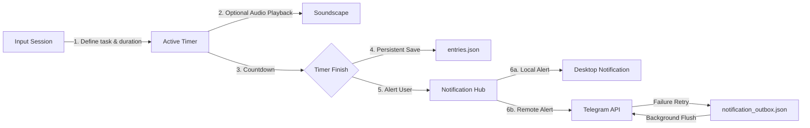

<div align="center">
  <h1>Kairu TUI</h1>
  <p>A keyboard-first, cross-platform productivity hub for the terminal</p>
</div>

<div align="center">
  
  
  
</div>

---

## What is Kairu TUI?

Kairu TUI is a sophisticated terminal-based productivity tool designed for deep focus and consistent habit building. Built with Go and the Bubbletea framework, it combines a Pomodoro-style timer with advanced streak tracking, atmospheric soundscapes, and a robust notification engine. It is built for developers and power users who live in the terminal and value privacy, speed, and keyboard-centric workflows.

## How it works

Kairu operates on a local-first principle, ensuring all your data remains on your machine while providing the convenience of multi-channel notifications via Telegram for mobile alerts.

### Architecture Diagram

```text
[ User Input ] <---> [ Bubbletea TUI ] <---> [ Local Storage (JSON/YAML) ]
                          |
                          v
               [ Soundscape Engine ] ----> [ External Audio Player (mpv) ]
                          |
                          v
               [ Notification Hub ] ----> [ Desktop Notifications ]
                          |
                          +-------------> [ Telegram Bot API ]
                          |                      ^
                          v                      |
               [ Outbox Retry Logic ] <----------+
```

### Hard Rules

- **Local-First:** All session history (`entries.json`) and configuration remain local. No mandatory cloud accounts.
- **Keyboard-Driven & Accessible:** Every action, from starting a timer to managing templates and navigating settings, is accessible via hotkeys and arrow keys.
- **Offline Resilience & Concurrent Alerts:** Active alerts trigger on all enabled channels concurrently (Desktop toast, Sound, and Telegram Bot). Local outbox queue persists unsent notifications on failures, ensuring you never lose a streak.
- **Robust Session Retention:** Countdown timers continue to tick in the background while settings, help, templates, and dashboard screens are open, and your active session is safely written to disk even if you quit the app from any modal view.
- **Customizable Aesthetics:** Support for multiple color themes (Matrix, Cyberpunk, etc.) and layouts (Classic, Compact, Minimal).
- **Zero Distraction:** No GUI overhead. Purely terminal-based focus.

### Pipeline Diagram



## Live Demo

*Coming soon: Terminal recording or ASCIINEMA link.*

## Setup

### Prerequisites

- **Go:** 1.22 or higher
- **mpv:** (Recommended) Required for soundscape playback
- **Telegram Bot:** (Optional) Required for remote notifications

### Install

```bash
git clone https://github.com/sudo-Harshk/kairu-tui.git
cd kairu-tui
go build -o kairu
```

### Configure

1. Create a `kairu.yaml` for basic settings (theme, durations).
2. Create a `.env` file if using Telegram:
   ```env
   KAIRU_TELEGRAM_BOT_TOKEN=your_token_here
   KAIRU_TELEGRAM_CHAT_ID=your_chat_id_here
   ```

### Run

```bash
./kairu
```

## Usage

### Core Hotkeys
- `Tab`: Switch between input fields and views.
- `Space`: Pause or resume the active timer.
- `Ctrl + P`: Open the Template Manager.
- `Ctrl + M`: Toggle the Soundscape selector.
- `S`: Open the Settings panel.
  - **Vertical Navigation:** Move cursor using `Up`/`Down` Arrows, `j`/`k`, or `Tab`/`Shift+Tab`.
  - **Toggling & Selection:** Cycle presets or toggle options using `Space` or `Enter`.
  - **Incremental Adjustment:** Change volume levels, frequency offsets, or hours using `Left`/`Right` Arrows or `h`/`l`.
  - **Exit Settings:** Exit back to your previous active view (timer, break, or stats) using `Esc`.
- `?`: Toggle the help overlay.

### Soundscapes
Kairu includes a built-in Soundscape selector to help you maintain focus during work sessions. Press `Ctrl+M` from the input screen or while a timer is running to toggle the selector.

* **Natively Synthesized Tracks (No Dependencies):** Kairu features a built-in pure Go synthesizer engine that generates focus frequencies directly. These do not require any external audio players or files:
  * `[Synth] White Noise`
  * `[Synth] Pink Noise` (1/f distribution for gentle focus)
  * `[Synth] Brown Noise` (1/f² distribution for deep isolation)
  * `[Synth] Focus Binaural Beats` (Detuned carrier waves with adjustable presets to induce specific brainwave states)
* **Custom Audio Tracks (External Player):** To play your own files, place `.mp3`, `.wav`, `.ogg`, `.flac`, or `.m4a` files in the `soundscapes_dir` (default: `soundscapes/`). This requires an external player like `mpv` configured in `kairu.yaml`.

*Kairu automatically performs smooth, organic cubic smoothstep volume fading on native soundscapes when you pause/resume the timer, which can be tuned in the Settings menu.*

### Ambient & Synth Tuning
Press **S** to open settings and configure your focus environment:
- **Synth volume:** Adjust the master base level (0% to 100%).
- **Binaural preset:** Select a target neural frequency:
  - **Alpha (10Hz):** Relaxed focus & learning (120Hz carrier)
  - **Beta (20Hz):** Active thinking & coding (150Hz carrier)
  - **Theta (6Hz):** Deep focus & creative flow (100Hz carrier)
  - **Delta (3Hz):** Deep relaxation & rest (70Hz carrier)
  - **Custom:** Manually adjust carrier frequency and beat detuning gap in real time.
- **Fade speeds:** Configure fade-in and fade-out durations in milliseconds for smooth, pop-free audio transitions.


### Streak Recovery
Kairu features a unique **Recovery Mode**. If you miss exactly one day of work, the app enters recovery state. Completing a single session before midnight will "recover" your streak, preventing the demotivation of a reset.

## Tech Stack

| Component | Technology | Role |
| :--- | :--- | :--- |
| Language | Go | Core Logic & CLI |
| TUI Framework | [Bubbletea](https://github.com/charmbracelet/bubbletea) | State Management & UI |
| Styling | [Lipgloss](https://github.com/charmbracelet/lipgloss) | Terminal UI Aesthetics |
| Configuration | YAML / Dotenv | User Preferences & Secrets |
| Audio | mpv / Shell | Soundscape Playback |
| Storage | JSON | Flat-file Database |

## Design Decisions

- **Why JSON over SQLite?** For a personal TUI, portability and human-readability of data were prioritized. JSON allows users to easily inspect or backup their history without specialized tools.
- **Why Bubbletea?** It provides the most robust Elm-architecture implementation for Go, making the complex state transitions of a timer-based app predictable and bug-free.
- **Why External Audio?** By leveraging `mpv` or `vlc` via shell commands, Kairu remains lightweight and avoids the complexities of cross-platform audio CGO bindings.

## Acknowledgements

- [Charm Bracelet](https://charm.sh/) for the incredible TUI ecosystem.
- Inspired by the Pomodoro Technique and the need for a distraction-free, terminal-native focus tool.

## License

Distributed under the MIT License. See [LICENSE](LICENSE) for more information.

---
