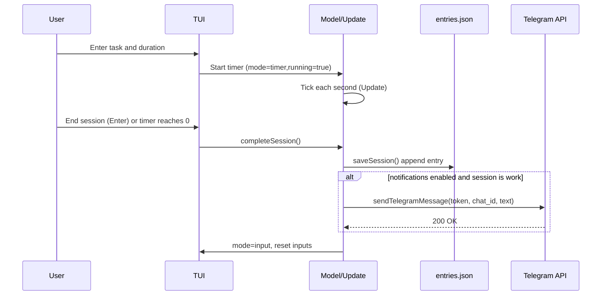

# Architecture

This page outlines the high-level architecture of Kairu TUI and the flow of a work session, including configuration, state, persistence, and notifications.

## Components

```mermaid
flowchart TD
    subgraph UI[TUI]
      IV[Input View]
      TM[Timer/Break View]
      EV[Edit View]
      SV[Stats View]
    end

    subgraph Core[Core Logic]
      ST[State Model\n(mode, seconds, inputs,\nentries, totals)]
      UP[Update Loop\n(tick, key events)]
      VW[View Functions]
    end

    subgraph Config[Configuration]
      KY[kairu.yaml]
      ENV[.env]
      LC[loadConfig + applyEnvOverrides]
    end

    subgraph Data[Persistence]
      EN[entries.json]
      SS[saveSession()]
    end

    subgraph Notify[Notifications]
      SN[sendNotification()]
      TG[sendTelegramMessage()]
      API[(Telegram API)]
    end

    IV -->|Enter| ST
    ST --> UP
    UP --> VW
    VW --> TM
    TM -->|Enter/Complete| SS --> EN
    SS --> SN
    SN -->|if notifications && work| TG --> API

    KY --> LC --> ST
    ENV --> LC
    SV --> VW
    EV --> VW
```

## Session Completion Sequence



## Notes
- Configuration loads defaults, merges kairu.yaml, then applies .env overrides for Telegram fields.
- entries.json stores an append-only history of sessions (work and break).
- Notifications are only sent for completed work sessions.
- The UI runs as a state machine with modes: input, timer, break, edit, stats.

