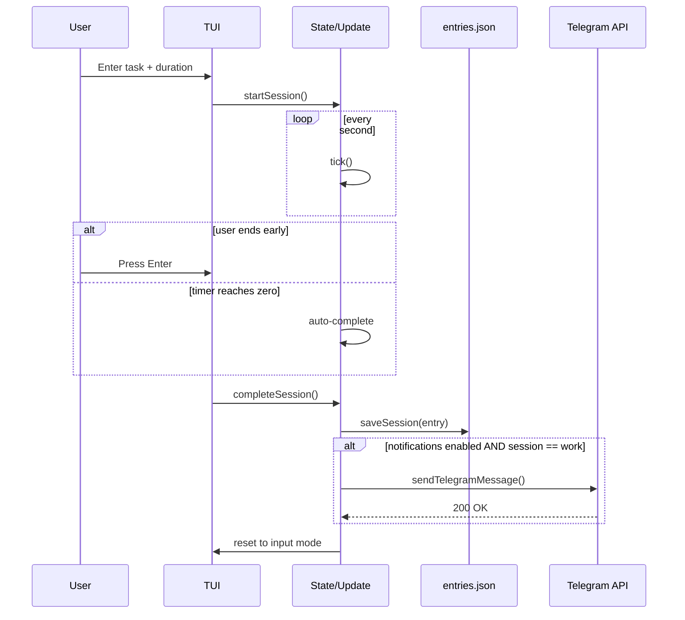

````md
# Architecture

This page outlines the high-level architecture of Kairu TUI and the flow of a work session, including configuration, state, persistence, and notifications.

## Components

```mermaid
flowchart TD
    %% UI Layer
    subgraph UI[TUI]
      IV[Input View]
      TV[Timer View]
      BV[Break View]
      EV[Edit View]
      SV[Stats View]
    end

    %% Core Logic
    subgraph Core[Core Logic]
      ST[State Model\n(mode, timeLeft, input,\nentries, totals, running)]
      UP[Update Loop\n(tick + key events)]
      VW[View Renderer]
      CS[completeSession()]
    end

    %% Configuration
    subgraph Config[Configuration]
      DF[Defaults]
      KY[kairu.yaml]
      ENV[.env]
      LC[loadConfig()]
    end

    %% Persistence
    subgraph Data[Persistence]
      EN[entries.json]
      SS[saveSession()]
    end

    %% Notifications
    subgraph Notify[Notifications]
      SN[sendNotification()]
      TG[sendTelegramMessage()]
      API[(Telegram API)]
    end

    %% Flow
    IV -->|start session| ST
    ST --> UP
    UP --> VW
    VW --> TV
    VW --> BV
    VW --> EV
    VW --> SV

    TV -->|complete / timeout| CS
    BV -->|complete| CS

    CS --> SS --> EN
    CS --> SN
    SN -->|if enabled & work session| TG --> API

    %% Config flow
    DF --> LC
    KY --> LC
    ENV --> LC
    LC --> ST
```

---

## Session Completion Sequence



---

## Notes

- Configuration loads in this order: **defaults → `kairu.yaml` → `.env` overrides**
- `entries.json` stores an **append-only history** of sessions (work and break)
- Notifications are only sent for **completed work sessions**
- The UI operates as a **state machine** with modes:
  - `input`
  - `timer`
  - `break`
  - `edit`
  - `stats`
- All rendering follows a unidirectional flow:  
  **State → Update → View**
````
